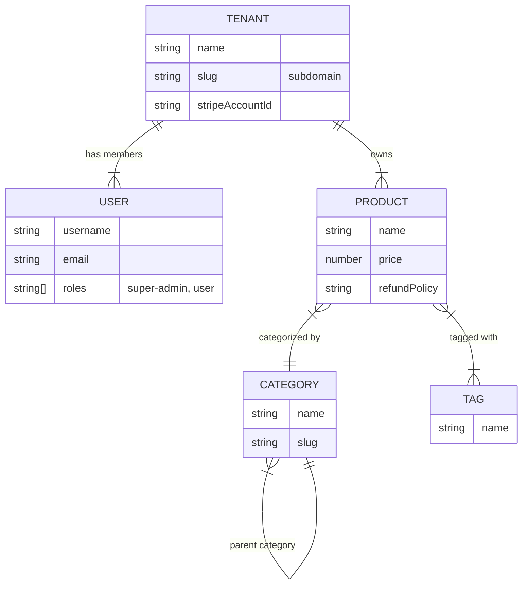

# MultiCart E-commerce Platform

A modern, multi-tenant e-commerce solution built with **Next.js 16** and **Payload CMS 3.0**. This platform allows multiple stores (tenants) to exist within a single installation, each with its own isolated products and configuration, while sharing a unified user base and infrastructure.

## 🚀 Tech Stack

- **Framework:** [Next.js 16](https://nextjs.org/) (App Router)
- **CMS & Backend:** [Payload CMS 3.0](https://payloadcms.com/)
- **Database:** MongoDB (via Mongoose)
- **Runtime:** [Bun](https://bun.sh/)
- **Styling:** Tailwind CSS v4, Radix UI, Lucide React
- **State Management:** Zustand, TanStack Query
- **API:** tRPC & GraphQL
- **Payments:** Stripe Connect

## ✨ Key Features

- **Multi-Tenancy:** Built-in support for multiple distinct stores (`Tenants`). Products are automatically scoped to the specific store they belong to.
- **Role-Based Access Control (RBAC):**
  - `Super Admin`: Can access and manage all tenants.
  - `User`: Can be assigned to specific tenants.
- **Product Management:** Complete CRUD for products with support for:
  - Hierarchical Categories (Parent/Child)
  - Tags
  - Media/Image uploads
  - Refund policies
- **Stripe Integration:** Merchants can connect their own Stripe accounts via Stripe Connect.
- **Modern UI:** Built with Shadcn/ui-compatible components and Tailwind v4.

## 📊 Data Model

The following diagram illustrates the relationships between the core collections in the system. The **Multi-Tenant Plugin** automatically enforces the relationship between `Tenants` and `Products`.



## 🛠️ Getting Started

### Prerequisites
- [Bun](https://bun.sh/) installed.
- MongoDB instance (local or Atlas).

### Installation

1. **Clone the repository:**
   ```bash
   git clone https://github.com/Vinay-mor/MultiCart-ecommerce.git
   cd MultiCart-ecommerce
   ```

2. **Install dependencies:**
   ```bash
   bun install
   ```

3. **Environment Setup:**
   Create a `.env` file in the root directory. You will need the following variables:
   ```env
   DATABASE_URI=mongodb://127.0.0.1/multicart
   PAYLOAD_SECRET=your-secret-key
   # Add other Stripe/Next.js keys as required
   ```

4. **Seed the Database (Optional):**
   Run the seed script to populate initial data.
   ```bash
   bun run db:seed
   ```

### Running the Project

- **Development Server:**
  ```bash
  bun run dev
  ```
  The app will be available at `http://localhost:3000`. Payload Admin panel is at `/admin`.

- **Build for Production:**
  ```bash
  bun run build
  bun run start
  ```

## 📜 Available Scripts

- `bun run dev`: Starts the Next.js development server.
- `bun run build`: Builds the application for production.
- `bun run lint`: Runs ESLint.
- `bun run generate:types`: Generates TypeScript types for Payload collections.
- `bun run db:fresh`: Drops the database and runs migrations.
- `bun run db:seed`: Seeds the database with initial data.
- `bun run db:reset`: Full reset (drop + seed).

## 📂 Project Structure

```
src/
├── app/            # Next.js App Router pages
├── collections/    # Payload CMS Collection Definitions
│   ├── Categories.ts
│   ├── Products.ts
│   ├── Tenants.ts  # Store configuration
│   └── Users.ts    # User auth & roles
├── components/     # React UI Components
├── modules/        # Feature-specific logic
├── payload.config.ts # Main Payload configuration
└── trpc/           # tRPC routers
```